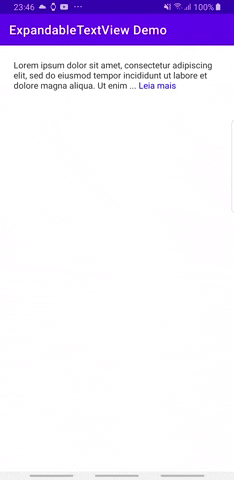

# ExpandableTextView

[](https://central.sonatype.com/artifact/io.github.glailton/expandabletextview)
[](https://appetize.io/app/b_tebmxa2vwvqnbyxetlafkh725e)
[](https://opensource.org/licenses/MIT)

An Expandable TextView for Android written in
[Kotlin](https://kotlinlang.org/). The main ideia was study how create a library in Android and deploy
on [Maven Central Repository](https://s01.oss.sonatype.org).


## Table of Contents

- [Demo project](#demo-project)
- [Getting started](#getting-started)
- [Features](#features)
- [Usage](#usage)
  - [XML](#in-xml)
  - [Programmatically](#programmatically)
- [Contributing](#contributing)
- [License](#license)
- [Acknowledgments](#acknowledgments)

## Demo Project

`ExpandableTextView` is a custom `TextView` that allows long text to be collapsed or expanded, either inline within the layout or via a popup dialog.
Take a look at the [demo project](app).



## Getting Started

The library is included in Maven Central Repository, so just add this dependency to your module level `gradle.build`:

```kotlin
dependencies {
    implementation 'io.github.glailton.expandabletextview:expandabletextview:$LatestVersion'
}
```
Current latest version is: [](https://search.maven.org/artifact/io.github.glailton.expandabletextview/expandabletextview)

## Features

- Collapsible/expandable text with animation.
- Two expansion modes: layout-based and popup.
- Custom "read more" / "read less" labels.
- Ellipsized text with custom color and underline.
- Optional fade animation on expand/collapse.
- Supports usage in XML, programmatically, or with data binding.

---

## XML Attributes

| Attribute               | Type    | Description                                                                 |
|------------------------|---------|-----------------------------------------------------------------------------|
| `collapsedLines`       | Integer | Number of lines to show when collapsed. Default is 3.                       |
| `isExpanded`           | Boolean | Initial expansion state. Default is `false`.                                |
| `animDuration`         | Integer | Animation duration in milliseconds. Default is 300.                         |
| `readMoreText`         | String  | Text shown to expand the view. Default is `"Read more"`.                    |
| `readLessText`         | String  | Text shown to collapse the view. Default is `"Read less"`.                  |
| `expandType`           | Enum    | Either `layout` or `popup`. Default is `layout`.                            |
| `ellipsizeTextColor`   | Color   | Color of the ellipsis and expand label. Default is `Color.BLUE`.            |
| `isUnderlined`         | Boolean | Whether the expand/collapse label should be underlined. Default is `false`. |
| `fadeAnimationEnabled` | Boolean | Enable or disable fade animation. Default is `true`.                         |

---

## Usage

### In XML

Xml snippet:
```xml
<io.github.glailton.expandabletextview.ExpandableTextView
        android:id="@+id/expand_tv"
        android:layout_width="match_parent"
        android:layout_height="wrap_content"
        expandableTextView:collapsedLines="3"
        expandableTextView:fadeAnimationEnabled="true"
        expandableTextView:animDuration="500"
        expandableTextView:readMoreText="Leia mais"
        expandableTextView:readLessText="Leia menos"
        expandableTextView:textMode="line"
        expandableTextView:isExpanded="true"
        app:expandType="layout"
        android:text="@string/very_long_text" />
```
### Programmatically
```
        binding.expandTvProg
          .setAnimationDuration(500)
          .setFadeAnimationEnabled(true)
          .setReadMoreText("View More")
          .setReadLessText("View Less")
          .setCollapsedLines(3)
          .setIsExpanded(true)
          .setIsUnderlined(true)
          .setExpandType(EXPAND_TYPE_POPUP)
          .setEllipsizedTextColor(ContextCompat.getColor(this, R.color.purple_200))

        binding.expandTvProg.text =
            "Lorem ipsum dolor sit amet, consectetur adipiscing elit, sed do eiusmod tempor incididunt ut labore et dolore magna aliqua." +
                    "Ut enim ad minim veniam, quis nostrud exercitation ullamco laboris nisi ut aliquip ex ea commodo consequat." +
                    "Duis aute irure dolor in reprehenderit in voluptate velit esse cillum dolore eu fugiat nulla pariatur." +
                    "Excepteur sint occaecat cupidatat non proident, sunt in culpa qui officia deserunt mollit anim id est laborum."

        binding.expandTvProg.setOnClickListener {
            binding.expandTvProg.toggle()
            if (binding.expandTvVeryLong.isExpanded && binding.expandTvVeryLong.expandType == EXPAND_TYPE_LAYOUT)
                binding.expandTvVeryLong.toggle()
        }
```

## Contributing

If you wish to send a pull request, please make sure to checkout from `main` branch and merge with `main` branch as well.

## License

This project is licensed under the MIT License - see the [LICENSE](LICENSE) file for details.

## Acknowledgments

This library was based on: [viewmore-textview](https://github.com/mike5v/viewmore-textview).
